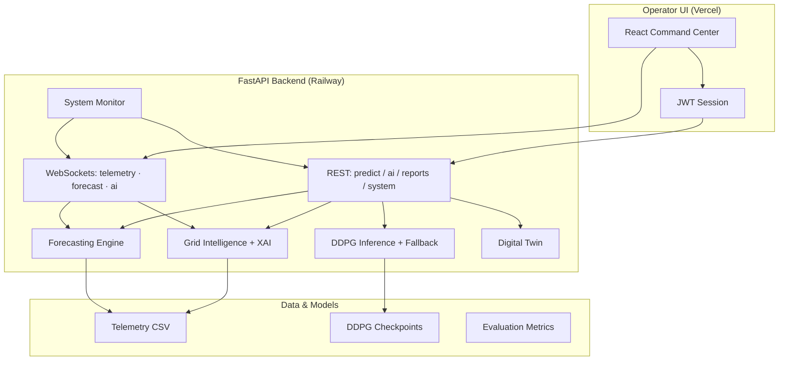

# V2B Neural Grid

**AI-Powered Smart EV Charging Infrastructure**

> Production-grade Vehicle-to-Building (V2B) platform combining **Deep Deterministic Policy Gradient (DDPG)** reinforcement learning, real-time grid telemetry, explainable AI, and a neon command-center dashboard for fleet operators and energy engineers.

[](https://fastapi.tiangolo.com/)
[](https://react.dev/)
[](https://pytorch.org/)
[](#deployment)

---

## Table of contents

- [System overview](#system-overview)
- [Key capabilities](#key-capabilities)
- [Tech stack](#tech-stack)
- [Architecture at a glance](#architecture-at-a-glance)
- [Quick start](#quick-start)
- [Repository structure](#repository-structure)
- [Engineering highlights](#engineering-highlights)
- [Performance optimizations](#performance-optimizations)
- [Resume-worthy achievements](#resume-worthy-achievements)
- [Screenshots](#screenshots)
- [Documentation](#documentation)
- [License](#license)

---

## System overview

**V2B Neural Grid** is an end-to-end smart charging operations platform. EV fleets charge and discharge against building load, solar generation, time-of-use pricing, and grid stress signals. A trained **DDPG actor** proposes continuous charger actions; **rule-based safety overlays** and **action masking** enforce feasibility. Operators interact through a **React command center** fed by **three WebSocket channels** (telemetry, forecast, AI ops).

| Layer | Responsibility |
|--------|----------------|
| **RL core** | Gymnasium `V2BChargingEnv`, 23-dim state builder, masked continuous actions, λ-weighted reward |
| **Inference API** | FastAPI `/predict`, checkpoint loading, heuristic fallback when models are absent |
| **Grid intelligence** | Telemetry-driven decisions, fleet views, alerts, activities |
| **Explainability** | Factor rankings, safety narratives, policy attribution (DDPG vs rules) |
| **Forecasting** | Rolling-window extrapolation for load, peak, renewable, SOC, stress |
| **Digital twin** | Steppable simulation with optional RL action injection |
| **Frontend** | JWT auth, lazy routes, batched WebSockets, Recharts analytics |
| **Observability** | CPU/RAM, API & inference latency percentiles, WS throughput |
| **Enterprise exports** | CSV/PDF reports (telemetry, decisions, forecast, executive bundle) |

Deep dives: **[architecture.md](./architecture.md)** · **[deployment.md](./deployment.md)**

---

## Key capabilities

- **DDPG smart charging** — Multi-charger continuous control with OU exploration in training and deterministic inference in production
- **Real-time operations dashboard** — Load, SOC, charging, forecast, battery health, optimization, and AI decision panels
- **Explainable AI (XAI)** — Human-readable reasoning for charging, renewable, peak-shaving, and battery protection strategies
- **Live streaming** — `/ws/telemetry`, `/ws/forecast`, `/ws/ai` with reconnect and session-aware auth
- **Digital twin** — Scenario-based grid simulation (`/ai/digital-twin/*`)
- **Production deployment** — Railway (API + WebSockets) + Vercel (SPA) with health probes and graceful fallbacks
- **Report Center** — Enterprise PDF/CSV exports with RL metrics and explainability summaries

---

## Tech stack

| Area | Technologies |
|------|----------------|
| **ML / RL** | Python 3.11+, PyTorch, Gymnasium, NumPy, Pandas |
| **API** | FastAPI, Uvicorn, WebSockets, Pydantic Settings, SQLAlchemy, JWT (python-jose) |
| **Frontend** | React 19, Vite 8, React Router 7, Tailwind CSS, Recharts, Axios |
| **Data** | CSV telemetry pipelines, SQLite (auth), evaluation artifacts |
| **Ops** | psutil observability, Docker Compose, Railway, Vercel |
| **Docs / export** | fpdf2 (PDF reports) |

---

## Architecture at a glance



---

## Quick start

### Prerequisites

- **Python 3.11+**
- **Node.js 20+**
- Optional: CUDA for local training; **CPU torch** is sufficient for inference

### 1. Backend

```bash
cd ev_rl_project
python -m venv venv
venv\Scripts\activate          # Windows
pip install -r requirements.txt
pip install torch --index-url https://download.pytorch.org/whl/cpu

cp backend\.env.example backend\.env
# Edit JWT_SECRET_KEY, paths, CORS as needed

uvicorn backend.main:app --reload --host 0.0.0.0 --port 8001
```

### 2. Frontend

```bash
cd frontend
npm ci
cp .env.production.example .env.local
# VITE_API_BASE_URL=http://localhost:8001
# VITE_WS_BASE_URL=ws://localhost:8001

npm run dev
```

Open **http://localhost:5173** → sign up / log in → **Dashboard**.

### 3. Train & evaluate (optional)

```bash
python data/preprocess.py --mode telemetry   # if needed
python backend/rl/train_ddpg.py              # telemetry DDPG
python train.py                              # full V2B env training
python evaluate.py                           # writes evaluation/*.json / *.csv
```

Place checkpoints under `checkpoints/quick_test/best/` (see [deployment.md](./deployment.md)).

---

## Repository structure

```
ev_rl_project/
├── agents/                 # Core DDPG agent (actor/critic, replay, OU noise)
├── backend/                # FastAPI app, inference, WS, XAI, reports, auth
│   ├── rl/                 # Telemetry DDPG training & policy hooks
│   ├── main.py             # Application entry + routes
│   └── railway.py          # Production Uvicorn launcher
├── rl_env/                 # Gymnasium V2B environment, mask, reward, state
├── frontend/               # React command center (Vite)
├── data/                   # Processed datasets & grid telemetry CSV
├── checkpoints/            # Trained actor/critic weights (not always in git)
├── evaluation/             # Episode metrics & reports
├── train.py                # Full-environment DDPG training loop
├── evaluate.py             # Offline policy evaluation
├── docker-compose.yml      # Local/production stack
├── architecture.md         # System design reference
└── deployment.md           # Production deployment guide
```

---

## Engineering highlights

| Highlight | Implementation |
|-----------|----------------|
| **Fail-safe inference** | `ModelService` serves DDPG when checkpoints exist; transparent heuristic fallback otherwise |
| **Safety-first control** | `ActionMask` (Algorithm 1) + grid intelligence overlays for thermal, degradation, peak stress |
| **Dual policy paths** | Full `V2BChargingEnv` training (`train.py`) + lightweight telemetry actor (`backend/rl/`) |
| **Streaming ops plane** | Dedicated AI channel multiplexes inference, fleet, alerts, and activities |
| **XAI by design** | `build_explanation()` attaches factors, reasoning, and policy source to every inference |
| **Auth-hardened API** | JWT with expiry handling; protected routes; WS disconnect on logout |
| **Modular forecasting** | `ForecastingEngine` designed for swap-in (ARIMA, Prophet, neural forecasters) |
| **Enterprise reporting** | `report_generator.py` — PDF/CSV with RL, renewable, battery, optimization sections |

---

## Performance optimizations

Frontend (production dashboard):

- **Route-level code splitting** — `React.lazy` + `Suspense` for all major pages
- **Split telemetry context** — Stream vs chart vs ops consumers avoid global rerender storms
- **WebSocket batching** — `wsBatcher` + `requestAnimationFrame` coalescing (~500 ms flush)
- **Memoized charts** — `React.memo`, selector hooks, `RECHARTS_PERF` (animations off in prod)
- **Digital twin throttling** — `useDeferredValue` + visibility cleanup on canvas
- **Observability dedup** — Single coalesced fetch for `/system/*` bundle

Backend:

- **Async telemetry load** — `asyncio.to_thread` for CSV reads in WS loop
- **Row cache TTL** — Configurable `ws_rows_cache_ttl_sec` reduces disk churn
- **Rolling latency windows** — O(1) amortized percentiles in `SystemMonitor`
- **Single-worker Railway** — Predictable WebSocket fan-out (documented in deployment guide)

---

## Resume-worthy achievements

Use these bullets on a résumé or portfolio (quantify where you have real numbers from your runs):

- Architected and shipped **V2B Neural Grid**, a full-stack **AI smart charging platform** with **DDPG reinforcement learning**, real-time **WebSocket telemetry**, and a production **React operations dashboard** deployed on **Railway + Vercel**.
- Implemented **23-dimensional state encoding**, **continuous action masking**, and **multi-objective reward design** (energy cost, peak demand, renewable utilization, battery degradation) aligned with V2B research (arXiv:2502.18526).
- Built **explainable AI layer** translating RL actions and grid features into operator-facing narratives, confidence scores, and safety prioritization.
- Designed **resilient inference pipeline** with checkpoint hot-load, startup validation, and **zero-downtime heuristic fallback** for demo and disaster-recovery scenarios.
- Delivered **sub-second operational UX** via WS batching, context splitting, and chart memoization across 50+ live telemetry points.
- Established **production observability** — API/inference/forecast latency percentiles, host metrics, WebSocket client counts, and health endpoints (`/healthz`, `/system/*`).
- Added **enterprise report exports** (PDF/CSV) covering telemetry, AI decisions, forecasts, RL evaluation metrics, and optimization summaries.

---

## Screenshots

> Add captures under `docs/screenshots/` and reference them here for README rendering on GitHub.

| View | Description | Path |
|------|-------------|------|
| **Command dashboard** | Real-time load, SOC, metrics, optimization | `docs/screenshots/dashboard.png` |
| **Grid analytics** | Historical charts + forecast panels | `docs/screenshots/analytics.png` |
| **AI decisions** | RL recommendations + explainability | `docs/screenshots/ai-decisions.png` |
| **Digital twin** | 3D/2D energy flow visualization | `docs/screenshots/digital-twin.png` |
| **Report Center** | Enterprise export workflow | `docs/screenshots/report-center.png` |
| **Observability** | System health & performance panels | `docs/screenshots/observability.png` |

**Suggested capture flow:** log in → open Dashboard → Analytics → AI Decisions → Reports → resize to 1440×900 for consistency.

---

## Documentation

| Document | Contents |
|----------|----------|
| **[architecture.md](./architecture.md)** | RL/DDPG pipeline, XAI, forecasting, WebSockets, digital twin, scalability, observability |
| **[deployment.md](./deployment.md)** | Local, Docker, Railway, Vercel, env vars, checkpoints, production checklist |
| [RAILWAY-PRODUCTION.md](./RAILWAY-PRODUCTION.md) | Railway-specific runbook |
| [frontend/VERCEL-PRODUCTION.md](./frontend/VERCEL-PRODUCTION.md) | Vercel-specific runbook |
| [backend-deployment.md](./backend-deployment.md) | Backend deployment notes |

---

## API surface (summary)

| Method | Path | Purpose |
|--------|------|---------|
| `GET` | `/healthz` | Liveness (always 200 when process up) |
| `GET` | `/health` | Model + startup diagnostics |
| `POST` | `/predict` | DDPG inference (JWT) |
| `GET` | `/ai/inference` | Latest grid intelligence snapshot |
| `GET` | `/metrics` | Cached RL evaluation metrics |
| `GET` | `/system/health` | Observability KPIs |
| `WS` | `/ws/telemetry` | Live telemetry stream |
| `WS` | `/ws/forecast` | Forecast bundle stream |
| `WS` | `/ws/ai` | AI ops multiplex stream |
| `GET` | `/reports/export/*` | Enterprise CSV/PDF exports |

Interactive docs: `http://localhost:8001/docs` (development).

---

## License

This project is provided for portfolio and research demonstration. Add your license file (`LICENSE`) before public distribution if not already present.

---

<p align="center">
  <strong>V2B Neural Grid</strong> — Reinforcement learning for the built environment.<br/>
  <sub>Questions? Start with <a href="./architecture.md">architecture.md</a> or <a href="./deployment.md">deployment.md</a>.</sub>
</p>
