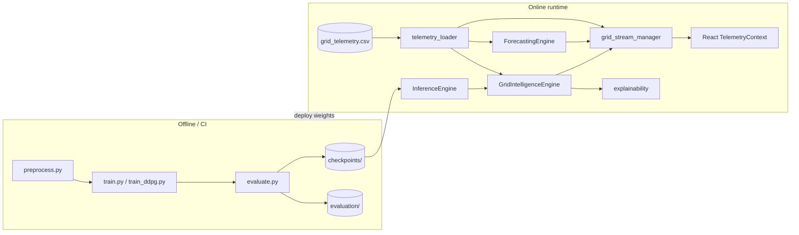
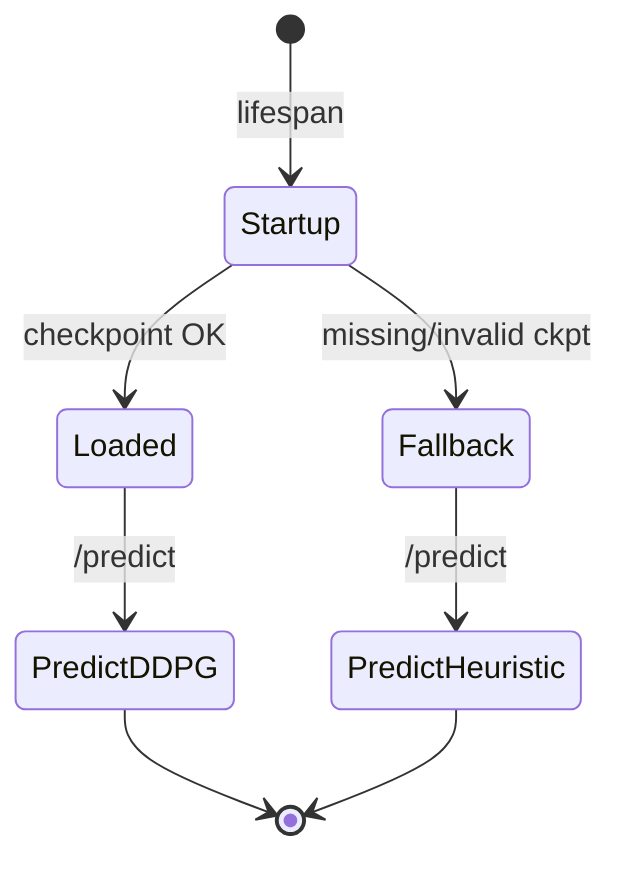
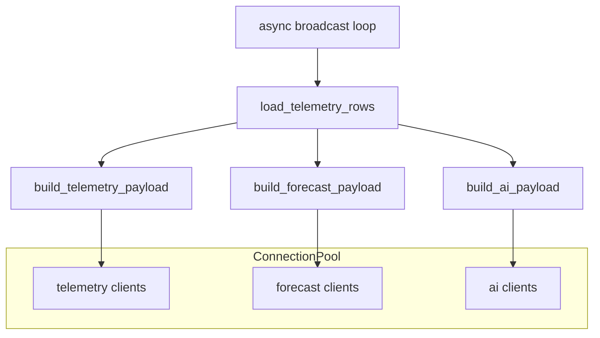
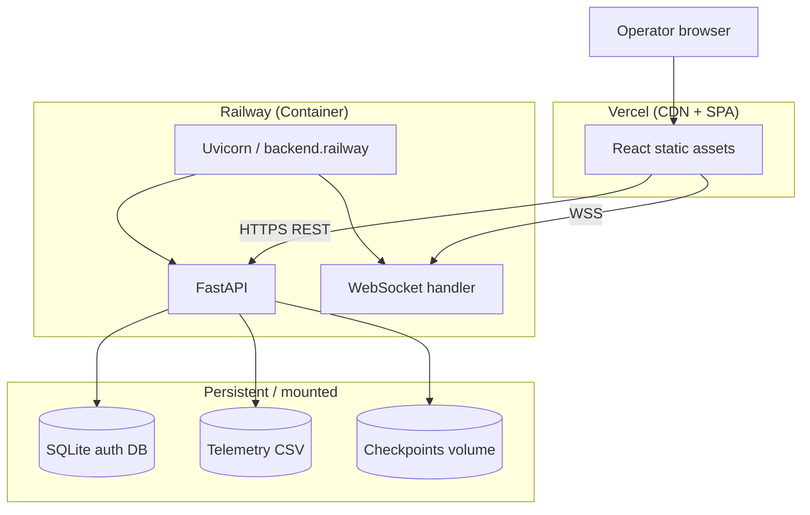

# V2B Neural Grid — System Architecture

Technical reference for engineers, architects, and technical interviewers. Describes how reinforcement learning, real-time streaming, explainability, and production services fit together.

---

## Table of contents

1. [Design principles](#1-design-principles)
2. [Logical architecture](#2-logical-architecture)
3. [RL architecture](#3-rl-architecture)
4. [DDPG pipeline](#4-ddpg-pipeline)
5. [State, actions, and rewards](#5-state-actions-and-rewards)
6. [Inference and fallback](#6-inference-and-fallback)
7. [Grid intelligence layer](#7-grid-intelligence-layer)
8. [Explainable AI (XAI)](#8-explainable-ai-xai)
9. [Forecasting engine](#9-forecasting-engine)
10. [WebSocket architecture](#10-websocket-architecture)
11. [Digital twin architecture](#11-digital-twin-architecture)
12. [Frontend architecture](#12-frontend-architecture)
13. [Observability system](#13-observability-system)
14. [Enterprise reporting](#14-enterprise-reporting)
15. [Scalability design](#15-scalability-design)
16. [Production architecture](#16-production-architecture)
17. [Security model](#17-security-model)

---

## 1. Design principles

| Principle | How it shows up |
|-----------|-----------------|
| **Graceful degradation** | Missing checkpoints, CSV, or GPU never crash the API; fallbacks are explicit in `/health` |
| **Separation of concerns** | RL inference (`inference.py`) ≠ operational reasoning (`grid_intelligence.py`) ≠ UI mapping (`stream_payloads.py`) |
| **Operator trust** | Every AI decision can carry explainability, confidence, and risk level |
| **Streaming-first UX** | Dashboards consume WebSockets; REST is for bootstrap, exports, and admin |
| **Observable by default** | Middleware + hooks record API, inference, forecast, and broadcast latencies |

---

## 2. Logical architecture



**Control plane:** FastAPI routes, JWT auth, startup validation (`startup.py`).  
**Data plane:** CSV telemetry rows, checkpoint tensors, WebSocket JSON payloads.  
**Experience plane:** React pages, charts, digital twin canvas, report exports.

---

## 3. RL architecture

The platform implements **Deep Deterministic Policy Gradient (DDPG)** for **continuous charging control** across multiple EV chargers connected to a building microgrid.

### 3.1 Two training surfaces

| Track | Entry | Environment | Use case |
|-------|--------|-------------|----------|
| **Full V2B** | `train.py` | `rl_env.ev_env.V2BChargingEnv` | Research-faithful simulation (arXiv:2502.18526), session arrivals, TOU pricing |
| **Telemetry DDPG** | `backend/rl/train_ddpg.py` | Telemetry-backed env | Faster iteration on real CSV traces |

Both share conceptual building blocks:

- **`StateBuilder`** — Fixed **23-dimensional** normalized observation vector
- **`ActionMask`** — Feasibility constraints (SOC bounds, charger limits, discharge floors)
- **`RewardFunction`** — λ-weighted blend of cost, peak, renewable use, degradation, satisfaction

### 3.2 Agent structure (`agents/ddpg_agent.py`)

```mermaid
flowchart TB
  S[State s] --> A[Actor μ(s)]
  A --> M[Action mask + scale]
  M --> E[Environment step]
  E --> R[Reward r]
  E --> S2[Next state s']
  S2 --> RB[(Replay buffer)]
  RB --> C[Critic Q(s,a)]
  RB --> A
  C -->|TD target| CT[Critic target]
  A -->|Policy gradient| AT[Actor target]
  AT -.->|Polyak τ| A
  CT -.->|Polyak τ| C
```

**Exploration (training):** Ornstein–Uhlenbeck noise on actor output, decayed per episode.  
**Exploitation (production):** Deterministic actor forward pass; optional `explore=false` on `/predict`.

### 3.3 Policy integration at runtime

- **`backend/inference.py`** — Loads actor weights from `checkpoints/quick_test/best/` (configurable), builds state from API request or telemetry features
- **`backend/rl/policy.py`** — Telemetry actor hook used by `GridIntelligenceEngine` when DDPG telemetry policy is loaded
- **`backend/rl_interfaces.py`** — Shared state vectors and reward components for digital twin steps

---

## 4. DDPG pipeline

### 4.1 Training loop (conceptual)

```
reset env → for each step:
    a = actor(s) + noise
    a = mask(a)
    s', r, done = env.step(a)
    replay.add(s, a, r, s', done)
    if ready: critic/actor update + soft-update targets
until episode done
```

Implemented in:

- `train.py` → `run_training_episode()` + `DDPGAgent.learn()`
- `backend/rl/train_ddpg.py` → `TelemetryDDPGAgent` with warmup and `learn_every` cadence

### 4.2 Evaluation pipeline

```
evaluate.py
  → roll out policies on held-out episodes
  → write evaluation/quick_test_run/episode_metrics.csv
  → write evaluation_report.json
```

Served at runtime via `GET /metrics` and embedded in **enterprise PDF exports**.

### 4.3 Inference pipeline

```
POST /predict
  → StateBuilder / request feature resolution
  → InferenceEngine.infer (torch, CPU/CUDA)
  → optional ActionMask + kW scaling
  → PredictResponse + latency recorded in SystemMonitor
```

If checkpoint load fails at startup, `ModelService.mark_fallback()` enables **heuristic actions** with identical API contract.

---

## 5. State, actions, and rewards

### 5.1 Observation space (`rl_env/state_builder.py`)

- **Dimension:** `STATE_DIM = 23` (normalized ∈ [0, 1] for API contract)
- **Features include:** SOC statistics, session progress, TOU tier signals, load/renewable context, charger availability

### 5.2 Action space

- **Raw output:** `tanh` ∈ [-1, 1] per charger dimension (default **8 chargers**)
- **Masked & scaled:** `ActionMask` enforces Algorithm 1 feasibility; `scale_tanh_to_power` maps to kW setpoints

### 5.3 Reward components (`rl_env/reward.py`)

| Signal | Intent |
|--------|--------|
| Electricity cost | Minimize spend under TOU |
| Peak demand | Penalize demand charges |
| Renewable utilization | Align charging with solar |
| Battery degradation | Discourage harmful cycling |
| Charging satisfaction | Meet departure SOC targets |

Episode `info` dict surfaces metrics consumed by evaluation CSVs and dashboard KPIs.

---

## 6. Inference and fallback



**`startup.py`** validates:

- Checkpoint directory readability
- Telemetry CSV sample row
- Forecast engine smoke test
- WebSocket manager start (non-fatal if disabled)

**Health semantics:**

- `/healthz` — process liveness (Railway probe)
- `/health` — `ok` | `degraded` | `error` based on model + component report

---

## 7. Grid intelligence layer

`GridIntelligenceEngine` (`backend/grid_intelligence.py`) is the **operations brain** over telemetry:

1. Ingest latest row + short history window
2. Run **DDPG telemetry policy** when loaded, else **rule-based** analysis
3. Apply **safety overlays** (thermal, degradation, peak stress)
4. Emit structured `GridInferenceResult`:
   - `optimization_action`, strategies (charging, renewable, peak shaving, grid balancing)
   - `decisions[]` for activity feed
   - `confidence_score`, `risk_level`
5. Attach explainability via `_attach_explainability()`

REST: `GET /ai/inference`  
WebSocket: included in `/ws/ai` multiplex payload (`build_ai_payload`).

---

## 8. Explainable AI (XAI)

Module: `backend/explainability.py`

### 8.1 Outputs (`GridExplanation` / dict payload)

| Field | Purpose |
|-------|---------|
| `reasoning` | Narrative paragraph for operators |
| `summary` | Short headline |
| `factors` / contributions | Ranked feature influences |
| `safety` | Thermal, battery, peak explanations |
| `policy_source` | `ddpg_telemetry_actor` vs `rule_engine` |
| Strategy blocks | Renewable, battery, peak-shaving rationale |

### 8.2 Pipeline

```
telemetry row + inference dict + optional ddpg_actions
  → interpret_all_actions()
  → compute_contributions()
  → rank_optimization_priorities()
  → build_safety_explanations()
  → _build_reasoning() + _build_summary()
```

XAI is consumed by:

- AI Decisions UI
- WebSocket AI channel
- Enterprise PDF exports (`report_generator.py`)

**Design note:** Explanations are **post-hoc interpretability** over engineered features—not SHAP on raw pixels—optimized for **latency and auditability** in operations centers.

---

## 9. Forecasting engine

Module: `backend/forecasting.py` — class `ForecastingEngine`

### 9.1 Algorithm (current)

- Extract rolling windows from telemetry history (default **window=24**, **horizon=6**)
- Per-series **linear least-squares extrapolation** (`_linear_forecast`)
- Derived **grid stress index** from load vs peak forecast ratio
- `summary_metrics()` for 1h trend, 24-point MA, next-step load

### 9.2 Outputs (`ForecastBundle`)

| Series | Description |
|--------|-------------|
| `load_kw` | Building/grid load projection |
| `peak_demand_kw` | Peak envelope |
| `renewable_kw` | Solar / renewable generation |
| `soc_percent` | Fleet SOC projection |
| `charging_demand_kw` | Aggregate charging |
| `grid_stress_index` | Normalized stress [0,1] |

### 9.3 Integration

- `forecast_safe()` — never throws; returns `fallback_bundle()` on empty history
- Patched by `system_monitor` for latency tracking
- Streamed on `/ws/forecast` at `ws_stream_interval_sec` (default 2.5s)

### 9.4 Extension point

Interface is intentionally simple to swap in **ARIMA**, **Prophet**, or **neural forecasters** without changing WebSocket contracts.

---

## 10. WebSocket architecture

Module: `backend/websocket_manager.py`

### 10.1 Channels

| Channel | Path | Payload focus |
|---------|------|----------------|
| `telemetry` | `/ws/telemetry` | Historical rows + live tick |
| `forecast` | `/ws/forecast` | `ForecastBundle` JSON |
| `ai` | `/ws/ai` | Inference, fleet, alerts, activities |

### 10.2 Connection pool



- **Per-channel sets** of `WebSocket` connections guarded by `asyncio.Lock`
- **Broadcast loop** loads rows (cached TTL), builds payloads, `send_json` to all subscribers
- **Disconnect cleanup** on `WebSocketDisconnect`
- **Metrics:** `system_monitor.record_stream_broadcast()`

### 10.3 Production considerations (Railway)

- Single worker process (`backend/railway.py`) for consistent fan-out
- `proxy_headers=True`, `ws="websockets"`, ping interval 20s
- Clients must use **`wss://`** in production (see deployment.md)

### 10.4 Frontend consumption

- `socketService.js` — connect, reconnect, JWT query param where applicable
- `wsBatcher.js` — coalesce messages before React state updates
- `TelemetryContext.jsx` — split contexts (stream / charts / ops) to limit rerenders

---

## 11. Digital twin architecture

Module: `backend/digital_twin.py`

### 11.1 Components

| Type | Role |
|------|------|
| `TwinScenario` | Fleet size, solar capacity, building load, peak cap, renewable target |
| `TwinState` | Tick, loads, SOC, stress, RL reward signal, node graph |
| `DigitalTwinSimulator` | Hourly step with solar curve, fleet activity, optional RL actions |

### 11.2 Step flow

```
POST /ai/digital-twin/reset  → initial TwinState
POST /ai/digital-twin/step   → optional action vector (8,) → next TwinState
```

When `actions` provided, charging kW derived from clipped tanh × scale; `GridIntelligenceEngine` can analyze resulting row; `rl_interfaces` compute reward components for dashboard display.

### 11.3 Frontend

- `DigitalTwinPanel.jsx` + `TwinCanvas.jsx`
- `useDeferredValue` for heavy geometry updates
- Visibility API teardown to prevent canvas leaks

---

## 12. Frontend architecture

### 12.1 Application shell

```
AuthProvider
  └── BrowserRouter
        ├── GuestRoute: /login, /signup
        └── ProtectedRoute → AppShell (Navbar, Sidebar)
              └── Lazy pages (Dashboard, Fleet, …, ReportCenter)
```

### 12.2 Key pages

| Route | Purpose |
|-------|---------|
| `/dashboard` | Real-time command center |
| `/analytics` | Historical charts + forecast panels |
| `/ai-decisions` | RL + XAI decision workspace |
| `/reports` | Enterprise export center |
| `/energy`, `/charging`, `/fleet` | Domain-specific ops views |

### 12.3 State management

- **No Redux** — React Context + hooks
- **Telemetry** — `TelemetryProvider` with `key={sessionKey}` remount on login/logout
- **Observability** — `ObservabilityContext` with memoized bundle fetch
- **Auth** — `AuthContext` + `authStorage` JWT expiry + 401 recovery

### 12.4 Build optimization (Vite)

Manual chunks: `vendor`, `charts`, `http` — smaller initial JS for non-chart routes.

---

## 13. Observability system

### 13.1 Backend (`backend/system_monitor.py`)

| Signal | Source |
|--------|--------|
| API latency | HTTP middleware in `main.py` |
| Inference latency | `/predict` handler |
| Forecast latency | Patched `forecasting_engine.forecast_safe` |
| Stream throughput | WS broadcast loop |
| Host CPU/RAM | `psutil` (optional) |
| GPU memory | `torch.cuda` when available |

### 13.2 API routes (`/system/*`)

| Endpoint | Data |
|----------|------|
| `GET /system/health` | Status, uptime, WS clients, model loaded |
| `GET /system/metrics` | CPU, memory, request rates |
| `GET /system/performance` | p50/p95 latencies, inference & forecast stats |

### 13.3 Frontend panels

- `SystemHealthPanel`, `PerformancePanel`, `InfrastructureMetrics`
- Coalesced fetch via `fetchObservabilityBundle()` (2.5s client cache)

---

## 14. Enterprise reporting

| Module | Role |
|--------|------|
| `backend/report_generator.py` | Aggregate telemetry, forecast, inference, RL metrics, XAI |
| `backend/report_routes.py` | `/reports/export/{telemetry,decisions,forecast,enterprise}` |
| `frontend/ReportCenter.jsx` | Preview + charts + `ExportPanel` |

PDF generation uses **fpdf2**; CSV uses stdlib + Pandas summaries.

---

## 15. Scalability design

### 15.1 Current scale profile

Designed for **single-region, single-tenant ops center** demos and pilot deployments:

- Thousands of telemetry rows (configurable `telemetry_row_limit`)
- Tens of concurrent WebSocket clients per channel
- Sub-100ms inference on CPU for 8-dim actions

### 15.2 Horizontal scaling path

| Component | Scale strategy |
|-----------|----------------|
| **API (stateless)** | Multiple replicas behind load balancer **except WebSockets** |
| **WebSockets** | Sticky sessions or Redis pub/sub bridge between workers |
| **Telemetry ingest** | Replace CSV with TimescaleDB / Kafka + stream processor |
| **Inference** | Model server (TorchServe/Triton) + GPU pool |
| **Forecasting** | Scheduled batch jobs writing to cache; WS serves cache only |
| **Auth** | External IdP (OAuth2) + short-lived JWT |

### 15.3 Caching layers (existing)

- WS row cache TTL (`ws_rows_cache_ttl_sec`)
- Evaluation metrics disk cache (`get_metrics`)
- Frontend observability bundle dedup

---

## 16. Production architecture



**Environment contract:** `ENVIRONMENT=production`, strong `JWT_SECRET_KEY`, `FRONTEND_URL` for CORS, `VITE_WS_BASE_URL=wss://…` on frontend.

Detailed steps: **[deployment.md](./deployment.md)**

---

## 17. Security model

| Layer | Mechanism |
|-------|-----------|
| Transport | HTTPS / WSS in production |
| Authentication | JWT bearer tokens (`backend/auth.py`) |
| Authorization | `require_authenticated_user` on sensitive routes |
| Session | Expiry detection client-side; 401 triggers logout + WS disconnect |
| CORS | Environment-driven origin list (no wildcard with credentials in prod) |
| Secrets | `JWT_SECRET_KEY` required in production (validated in settings) |

---

## Related documents

- [README.md](./README.md) — Overview, quick start, achievements
- [deployment.md](./deployment.md) — Production deployment runbook
- [RAILWAY-PRODUCTION.md](./RAILWAY-PRODUCTION.md) — Railway specifics
- [frontend/VERCEL-PRODUCTION.md](./frontend/VERCEL-PRODUCTION.md) — Vercel specifics
